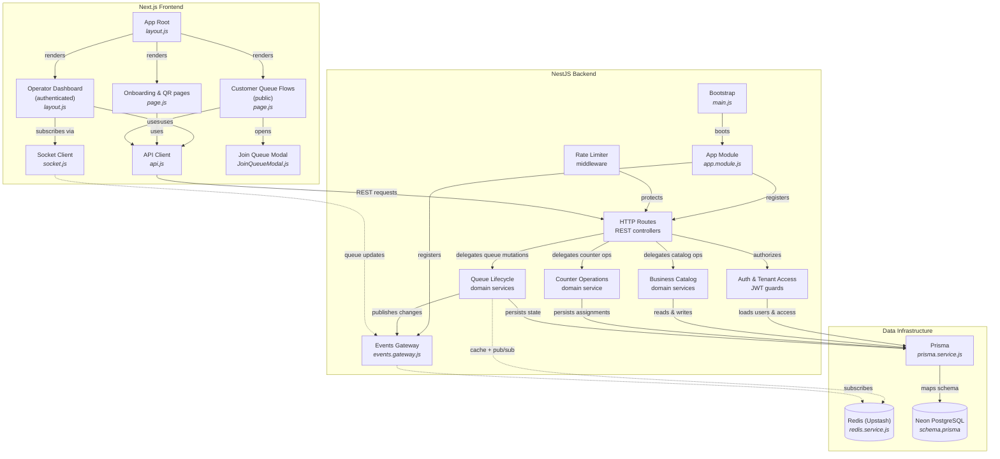
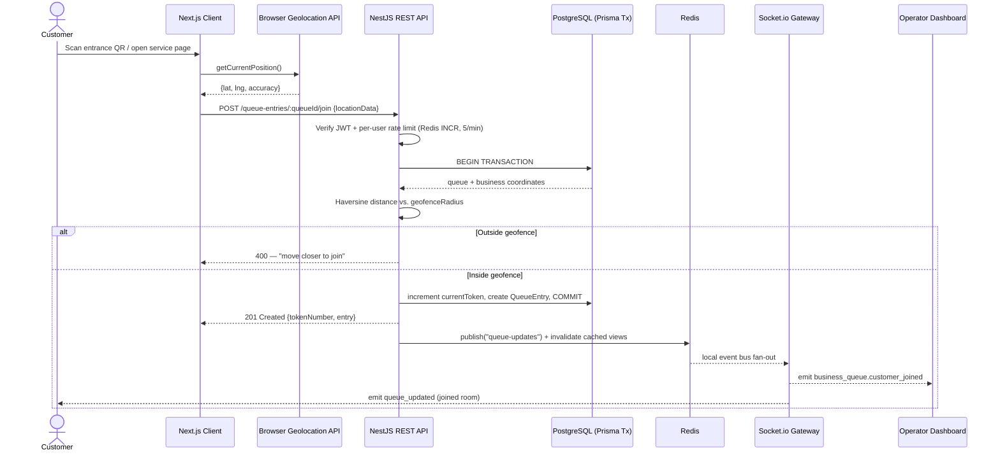
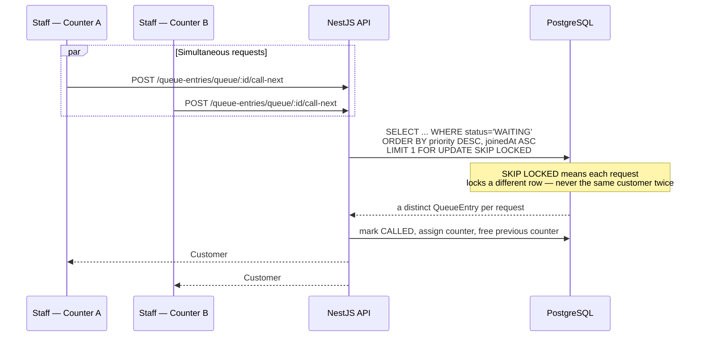
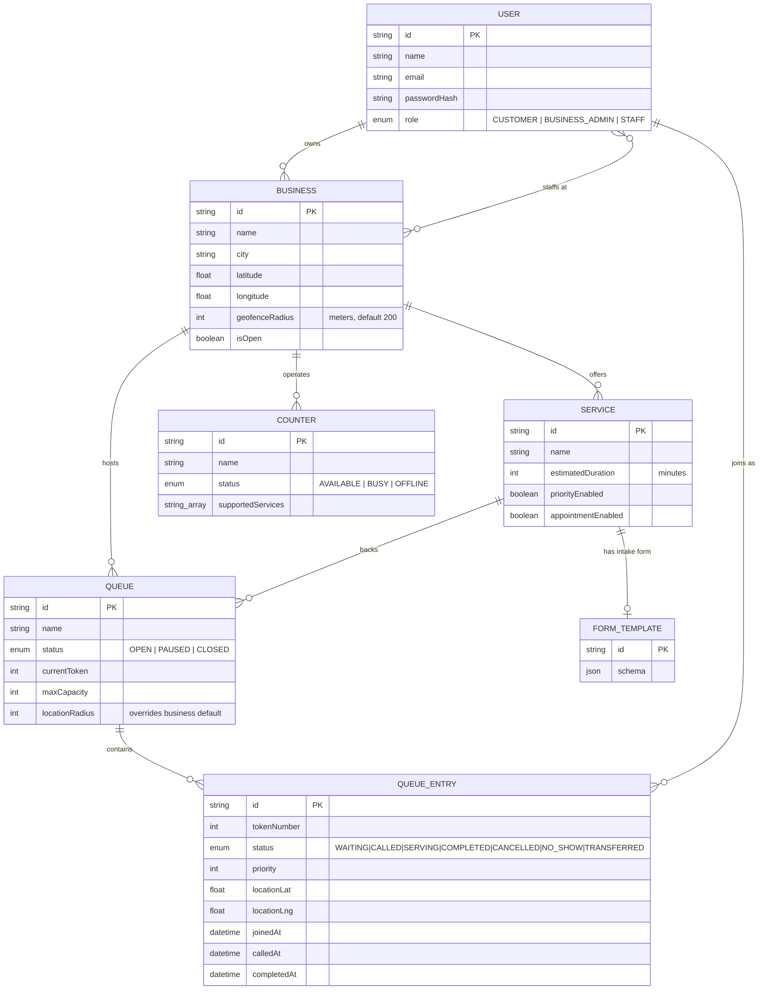

# QueueWise

**A geofenced, real-time queue and appointment management system that eliminates physical waiting lines.**

QueueWise lets customers scan a QR code, verify they're actually on-site via geofencing, and join a live digital queue — while business operators run multiple service counters from a real-time dashboard with live analytics.

[](https://nextjs.org/)
[](https://react.dev/)
[](https://nestjs.com/)
[](https://www.prisma.io/)
[](https://neon.tech/)
[](https://upstash.com/)
[](https://socket.io/)

**[Live Demo](https://queue-wise-omega.vercel.app)** · **[Report a Bug](https://github.com/Rupeshkumar780/QueueWise/issues)**

---

## Table of Contents

- [Overview](#overview)
- [Key Features](#key-features)
- [System Architecture](#system-architecture)
- [How It Works — Execution Flow](#how-it-works--execution-flow)
- [Data Model](#data-model)
- [Tech Stack](#tech-stack)
- [Project Structure](#project-structure)
- [API Reference](#api-reference)
- [Getting Started](#getting-started)
- [Environment Variables](#environment-variables)
- [Testing](#testing)
- [Deployment](#deployment)
- [Engineering Notes & Trade-offs](#engineering-notes--trade-offs)
- [Roadmap](#roadmap)
- [Contributing](#contributing)
- [License](#license)
- [Author](#author)

---

## Overview

Physical queues are a lose-lose: customers waste time standing in line, and businesses can't tell how crowded they actually are until it's too late. QueueWise digitizes that queue.

A customer scans a QR code posted at a business's entrance, opens a service page, and joins the queue directly from their phone — no app install required. Before the ticket is created, the **server independently verifies the customer's GPS position against the business's registered location**, so a queue can't be joined from across town. Once in line, the customer is free to wait anywhere and gets pushed live updates over WebSockets as their position in line changes.

On the other side, business staff run a live operations dashboard: opening/pausing/closing queues, calling the next customer to a specific counter, tracking no-shows, and reviewing real wait-time analytics — all updated in real time without polling.

## Key Features

**Customer experience**
- QR-code queue joining — no app download, just a browser
- Server-side **geofence verification** (Haversine distance check) before a ticket is issued
- Live ticket status: position in line, ETA, "now serving" counter — pushed over WebSockets
- Push-style browser notifications + device vibration when it's the customer's turn
- Custom per-service intake forms (dynamic JSON schema, e.g. "reason for visit")
- Ticket history ("My Tickets") and self-service cancellation

**Business / operator experience**
- Multi-counter operations — assign counters to specific services, track `AVAILABLE` / `BUSY` / `OFFLINE` status
- Concurrency-safe **"Call Next"** — uses PostgreSQL row locking so two counters can never be assigned the same customer
- Priority queueing (priority score + join time ordering)
- Role-based staff accounts (`BUSINESS_ADMIN`, `STAFF`) scoped to a specific business
- Live analytics dashboard (Recharts): hourly crowd distribution, weekly activity, service-wise ticket distribution, average wait time
- One-click QR code generator for entrance signage (printable)
- Google Maps link → lat/lng auto-extraction when configuring a business's geofence center
- Configurable geofence radius per business, overridable per queue

**Platform / engineering**
- JWT authentication with Argon2 password hashing
- Layered authorization: JWT guard → role guard → business-ownership/staff guard
- Redis-backed caching (cache-aside pattern) for analytics, dashboards, and public landing data, with **event-driven invalidation** on every mutation
- Two independent rate limiters: a global `ThrottlerGuard` and a Redis-`INCR`-based limiter on sensitive routes (auth, queue joins)
- Request-timing interceptor that logs slow requests (>500ms)
- `/health` endpoint that verifies live DB connectivity

## System Architecture



The frontend and backend are fully decoupled — the Next.js app never talks to the database directly, only through the versioned REST API (`/api/v1/...`) and a Socket.io connection for live updates.

## How It Works — Execution Flow

### 1. Joining a queue (geofence-gated)



### 2. Calling the next customer (race-condition safe)



This is the core correctness guarantee of the system: joins are protected by a DB transaction with a duplicate-entry check, and assignment is protected by `FOR UPDATE SKIP LOCKED` — so concurrent load can't create duplicate tickets or double-book a customer to two counters.

## Data Model



Indexes on `QueueEntry` (`[queueId, status]`, `[queueId, tokenNumber]`, `[userId, status]`, `[queueId, priority, joinedAt]`) keep the hot-path queries — position-in-line counts and the priority-ordered "call next" lookup — index-backed as ticket volume grows.

## Tech Stack

| Layer | Technology |
|---|---|
| Frontend framework | Next.js 16 (App Router), React 19 |
| Styling | Tailwind CSS 4 |
| Data visualization | Recharts |
| Realtime client | Socket.io-client |
| QR generation | qrcode.react |
| Notifications | react-hot-toast |
| Backend framework | NestJS 10 — written in plain JavaScript with legacy Babel decorators (not TypeScript) |
| Transpilation | Babel (`@babel/cli`, `@babel/register`, `@babel/node`) |
| ORM | Prisma 5 |
| Database | PostgreSQL — [Neon](https://neon.tech) serverless (pooled + direct/unpooled connections) |
| Cache & rate limiting | [Upstash Redis](https://upstash.com) (REST client) |
| Realtime transport | Socket.io via `@nestjs/websockets` gateway |
| Authentication | JWT (`passport-jwt`) + Argon2 password hashing |
| Validation | class-validator / class-transformer |
| Security | Helmet, `@nestjs/throttler`, custom Redis-backed rate limiter |
| Testing | Jest, Supertest |
| Frontend hosting | Vercel |
| Backend/DB/Cache hosting | Neon (Postgres) + Upstash (Redis) + any Node host (Render, Railway, Fly.io, etc.) |

## Project Structure

```
QueueWise/
├── backend/                        # NestJS API
│   ├── prisma/
│   │   └── schema.prisma           # Data model (User, Business, Queue, Counter, QueueEntry...)
│   ├── src/
│   │   ├── auth/                   # JWT strategy, roles guard, business-access guard
│   │   ├── businesses/             # Business CRUD, analytics, cached landing data
│   │   ├── counters/               # Counter status & service assignment
│   │   ├── events/                 # Socket.io gateway (events.gateway.js)
│   │   ├── interceptors/           # Slow-request logging
│   │   ├── middleware/             # Redis-backed rate limiter
│   │   ├── prisma/                 # PrismaService (DB client)
│   │   ├── queue-entries/          # Join/cancel/call-next/complete — core queue logic
│   │   ├── queues/                 # Queue lifecycle (open/pause/close)
│   │   ├── redis/                  # RedisService (Upstash REST + local pub/sub bridge)
│   │   ├── routes/                 # REST controllers (*.routes.js)
│   │   ├── services/               # Service catalog + dynamic form templates
│   │   ├── users/                  # User lookups
│   │   ├── utils/                  # Haversine geofence distance calculation
│   │   ├── app.module.js
│   │   └── main.js                 # Bootstrap, CORS, Helmet, global prefix
│   ├── test/                       # e2e + concurrency test specs
│   └── generate-sample-data.mjs    # Seeds a demo business via raw SQL
│
└── frontend/                       # Next.js App Router client
    └── src/
        ├── app/
        │   ├── auth/                            # Login / signup
        │   ├── business/[businessId]/           # Public customer-facing queue pages
        │   ├── dashboard/[businessId]/          # Operator dashboard (counters, staff, analytics, QR)
        │   ├── onboarding/business/              # Business setup wizard
        │   ├── queue/[queueEntryId]/             # Live ticket status page
        │   └── layout.js                         # Root layout, global toaster & notifications
        ├── components/
        │   ├── JoinQueueModal.js                 # Captures geolocation before submitting a join
        │   ├── GlobalNotification.js              # Cross-page Socket.io "it's your turn" alerts
        │   └── CustomerStatsDisplay.js / Hero.js / Navbar.js / Footer.js
        └── lib/
            ├── api.js                             # Fetch wrapper + JWT header injection
            └── socket.js                          # Socket.io client singleton
```

## API Reference

All backend routes are prefixed with `/api/v1` (health checks live at `/api/health` and `/api/v1/health`).

**Auth** — `/api/v1/auth`

| Method | Endpoint | Auth | Description |
|---|---|---|---|
| POST | `/register` | Public | Create an account (`CUSTOMER` or `BUSINESS_ADMIN`), returns a JWT |
| POST | `/login` | Public | Validate credentials, returns a JWT |
| GET | `/me` | JWT | Return the authenticated user's profile |
| POST | `/change-password` | JWT | Change password while logged in |
| POST | `/reset-password` | Public (requires current password) | Reset password after re-verifying the old one |

**Businesses** — `/api/v1/businesses`

| Method | Endpoint | Auth | Description |
|---|---|---|---|
| POST | `/` | JWT · `BUSINESS_ADMIN` | Create a business |
| GET | `/my` | JWT | List businesses the user owns or staffs |
| GET | `/` | Public | Search/list businesses by city or name |
| GET | `/:id` | Public | Get a business profile |
| POST | `/:id/update` | JWT · owner/staff | Update details, location & geofence radius |
| POST | `/:id/staff` | JWT · owner/staff | Add or invite a staff member |
| POST | `/:id/staff/:userId/remove` | JWT · owner/staff | Remove a staff member |
| GET | `/:id/customer-landing` | Public (cached) | Aggregated data for the public landing page |
| GET | `/:id/analytics` | JWT · ADMIN/STAFF | Wait-time, distribution & weekly-activity analytics (30s cache) |
| GET | `/:id/dashboard-stats` | JWT · ADMIN/STAFF | Live dashboard summary |
| GET | `/:id/live-operations` | JWT · ADMIN/STAFF | Real-time view of active queues & counters |

**Services** — `/api/v1/services`

| Method | Endpoint | Auth | Description |
|---|---|---|---|
| POST | `/:businessId` | JWT · ADMIN/STAFF | Create a service, optionally with a custom intake form schema |
| GET | `/business/:businessId` | Public | List a business's services |
| GET | `/:id` | Public | Get a service with its form template & queues |

**Queues** — `/api/v1/queues`

| Method | Endpoint | Auth | Description |
|---|---|---|---|
| POST | `/` | JWT · ADMIN/STAFF | Create a queue for a service |
| GET | `/business/:businessId` | Public | List queues for a business |
| PATCH | `/:id` | JWT · ADMIN/STAFF | Update capacity, geofence override, token prefix |
| POST | `/:id/open` \| `/pause` \| `/close` | JWT · ADMIN/STAFF | Change queue status and broadcast to subscribers |

**Counters** — `/api/v1/counters`

| Method | Endpoint | Auth | Description |
|---|---|---|---|
| POST | `/:businessId` | JWT · ADMIN/STAFF | Register a counter |
| GET | `/business/:businessId` | Public | List counters |
| POST | `/:id/status` | JWT · ADMIN/STAFF | Set `AVAILABLE`/`BUSY`/`OFFLINE`, recalculates queue status |
| DELETE | `/:id` | JWT · ADMIN/STAFF | Remove a counter (and orphaned service, if any) |

**Queue Entries (tickets)** — `/api/v1/queue-entries`

| Method | Endpoint | Auth | Description |
|---|---|---|---|
| POST | `/:queueId/join` | JWT | Join a queue — geofence-checked, rate-limited (5/min/user) |
| GET | `/my-tickets` | JWT | Current user's ticket history |
| GET | `/:id` | Public | Ticket status, position in line, ETA |
| GET | `/business/:businessId` | JWT · ADMIN/STAFF | Today's entries for a business |
| POST | `/:id/cancel` | JWT (owner) | Cancel your own waiting ticket |
| POST | `/:id/admin-cancel` | JWT · ADMIN/STAFF | Force-cancel a ticket |
| POST | `/queue/:queueId/call-next` | JWT · ADMIN/STAFF | Call the next customer (priority-aware, SKIP LOCKED) |
| POST | `/:id/complete` | JWT · ADMIN/STAFF | Mark a ticket served, free the counter |
| POST | `/:id/no-show` | JWT · ADMIN/STAFF | Mark a no-show, free the counter |

**Utilities & Metrics**

| Method | Endpoint | Auth | Description |
|---|---|---|---|
| POST | `/api/v1/utils/expand-maps-url` | Public | Resolve a shortened Google Maps link into `{lat, lng}` for geofence setup |
| GET | `/api/v1/metrics/redis` | Public | Redis cache hit/miss/error counters |
| GET | `/health`, `/api/v1/health` | Public | Liveness probe — pings the database |

## Getting Started

### Prerequisites

- Node.js 18+
- A PostgreSQL database — [Neon](https://neon.tech) is recommended since the schema is built around Neon's pooled + direct connection pattern
- An [Upstash Redis](https://upstash.com) database (optional, but caching/rate-limiting/live-update fan-out are disabled without it — the app degrades gracefully if unset)

### 1. Clone the repository

```bash
git clone https://github.com/Rupeshkumar780/QueueWise.git
cd QueueWise
```

### 2. Backend setup

```bash
cd backend
npm install

# create backend/.env — see Environment Variables below

npx prisma generate
npx prisma migrate dev --name init   # or: npx prisma db push

npm run start:dev                    # http://localhost:3001
```

Optionally seed a demo business ("TechFix Solutions") with sample queues and counters:

```bash
node generate-sample-data.mjs
```

### 3. Frontend setup

```bash
cd frontend
npm install

# create frontend/.env.local — see Environment Variables below

npm run dev                          # http://localhost:3000
```

Visit `http://localhost:3000`, sign up as a business admin to create your first business and service, or sign up as a customer to scan a QR and join a queue.

## Environment Variables

**`backend/.env`**

| Variable | Required | Default | Description |
|---|---|---|---|
| `PORT` | No | `3001` | Backend HTTP port |
| `DATABASE_URL` | Yes | — | Pooled Neon Postgres connection string |
| `DATABASE_URL_UNPOOLED` | Yes | — | Direct Neon connection — used for transactions and raw `FOR UPDATE` locks |
| `JWT_SECRET` | **Yes** | insecure fallback | Signs auth tokens — **must** be set to a strong secret in production |
| `JWT_EXPIRATION` | No | `7d` | JWT lifetime |
| `FRONTEND_URL` | Yes | `http://localhost:3000` | Allowed CORS origin for the REST API |
| `API_CORS_ORIGIN` | No | falls back to `FRONTEND_URL` | Allowed origin for the WebSocket gateway |
| `UPSTASH_REDIS_REST_URL` | No | — | Enables caching, rate limiting, and live-update fan-out |
| `UPSTASH_REDIS_REST_TOKEN` | No | — | Upstash REST API token |

**`frontend/.env.local`**

| Variable | Required | Default | Description |
|---|---|---|---|
| `NEXT_PUBLIC_API_URL` | Yes | `http://localhost:3001/api` | Base URL the client uses for REST calls |
| `NEXT_PUBLIC_SOCKET_URL` | No | derived from `NEXT_PUBLIC_API_URL` | WebSocket endpoint, if it differs from the API host |

> ⚠️ **Do not deploy with the default `JWT_SECRET` fallback.** `jwt.strategy.js` and `auth.module.js` both fall back to a hardcoded string if the environment variable is unset — fine for local dev, a real risk in production.

## Testing

```bash
cd backend
npm test          # Jest unit tests
npm run test:e2e  # Supertest end-to-end tests against a live Nest app instance
npm run test:cov  # Coverage report
```

**Current coverage, honestly:** `app.controller.spec.js` and `app.e2e-spec.js` are real, executable tests. `test/concurrency.spec.js` documents the intended race-condition guarantees (duplicate-join prevention, no double-assignment on `call-next`) but its two test cases are currently placeholder assertions (`expect(true).toBe(true)`) rather than actual load-simulation tests — worth implementing with real concurrent Prisma calls if you want CI to actually enforce those guarantees.

## Deployment

The live deployment splits cleanly along the same frontend/backend boundary:

- **Frontend** → [Vercel](https://vercel.com), pointed at `frontend/` with `NEXT_PUBLIC_API_URL` set to the deployed backend
- **Database** → [Neon](https://neon.tech) (serverless Postgres — the project already ships a `.neon` project config)
- **Cache** → [Upstash Redis](https://upstash.com)
- **Backend** → any Node process host (Render, Railway, Fly.io, a VPS, etc.) running `npm run build && npm start`

There is currently no `Dockerfile` or CI/CD pipeline in the repository — see [Roadmap](#roadmap).

## Engineering Notes & Trade-offs

A few decisions worth understanding before extending this system, rather than glossing over them:

- **Redis pub/sub is process-local, not distributed.** `RedisService.publish/subscribe` is implemented with a plain Node `EventEmitter`, not Redis's native pub/sub — because Upstash's REST API doesn't support persistent subscriptions. This works correctly for a single backend instance (which is what's deployed today), but if the backend is ever scaled horizontally to multiple instances, a customer connected to instance A would **not** receive a broadcast triggered by an action on instance B. Moving to a Redis provider with real pub/sub (or a managed socket layer like Ably/Pusher, or Socket.io's Redis adapter) would be required before scaling out the backend.
- **Geofencing is authoritative but binary.** The Haversine check happens server-side against `business.latitude/longitude`, so it can't be bypassed by editing client code — but it relies entirely on the accuracy of the browser's `navigator.geolocation`, which can be inaccurate indoors or spoofed by a rooted device/emulator. There's no secondary signal (e.g., Wi-Fi BSSID, IP geolocation cross-check) backing it up.
- **Two geofence utilities exist; only one is used.** `utils/geo.util.js` (kilometers) is the one actually imported by `queue-entries.service.js`. `utils/geolocation.util.js` (meters) is dead code from an earlier iteration — safe to delete.
- **`JWT_SECRET` has an insecure default.** Both `jwt.strategy.js` and `auth.module.js` fall back to a hardcoded string if the env var isn't set. Convenient for local dev, but it means a misconfigured production deployment fails *open* into an insecure state rather than refusing to boot.
- **The backend is JavaScript, not TypeScript**, using Babel with legacy decorators to get NestJS's decorator-based DI working without a TS compiler. This is a deliberate, unusual choice — NestJS is designed around TypeScript, so this trades away compile-time type safety for a simpler build step.

## Roadmap

- [ ] Replace the local `EventEmitter` pub/sub bridge with a horizontally-scalable realtime layer (Redis adapter for Socket.io, or a managed pub/sub service)
- [ ] Flesh out `concurrency.spec.js` into real load-simulated assertions
- [ ] Containerize with Docker + docker-compose for one-command local setup
- [ ] Add a CI pipeline (lint, test, migration check) on pull requests
- [ ] SMS/email notifications as a fallback to in-app/browser push
- [ ] Appointment scheduling (the `Service.appointmentEnabled` flag already exists in the schema but isn't wired up yet)

## Contributing

1. Fork the repository
2. Create a feature branch: `git checkout -b feature/your-feature`
3. Commit your changes: `git commit -m "Add your feature"`
4. Push to the branch: `git push origin feature/your-feature`
5. Open a Pull Request


## Author

**Rupesh Kumar**
[GitHub](https://github.com/Rupeshkumar780) · [LinkedIn](https://www.linkedin.com/in/rupesh-kumar-240437287/)
